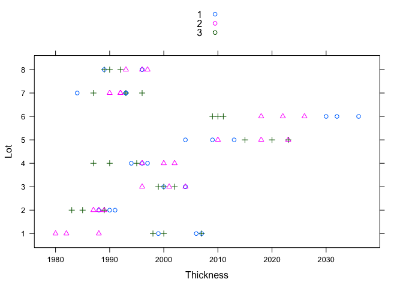
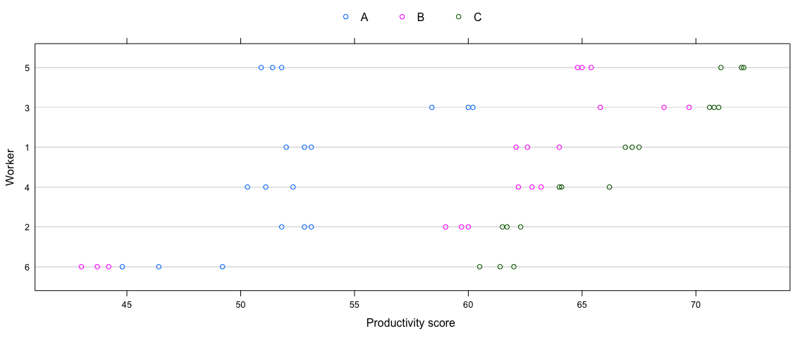
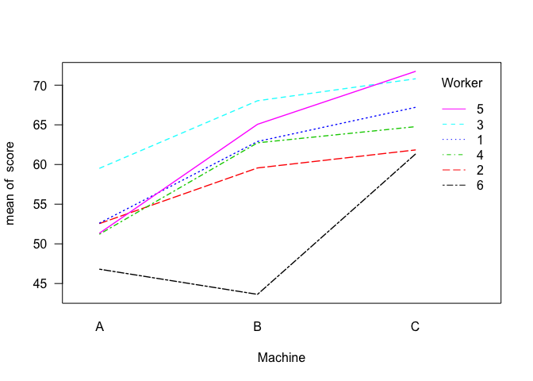
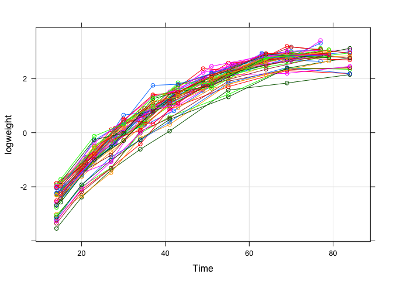
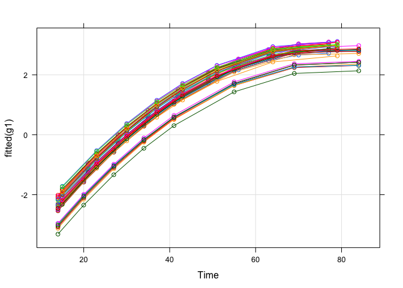
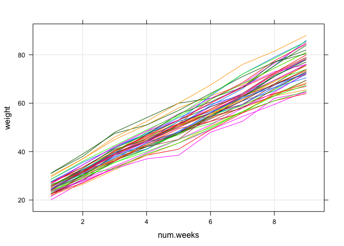

# **Additional examples**
Dae-Jin Lee  
March 2016  


----------------------------

# Case studies 

### Variability in Semiconductor Manufacturing


These data are described in @Littel96 as coming *from a passive data collection study in the semiconductor industry where the objective is to estimate the variance components to determine the assignable causes of the observed variability*. The observed response is the thickness of the oxide layer on silicon wafers, measured at three different sites of each of three wafers selected from each of eight lots sampled from the population of lots.

```r
library(nlme)
library(lattice)
data(Oxide)
?Oxide
xyplot(Lot~Thickness,group=Wafer,auto.key=TRUE,pch=Oxide$Site,data=Oxide)
```

<div class="figure">

<p class="caption">*Thickness of Oxide layer measured on different sites of wafers selected from a sample of manufacturing lots.*</p>
</div>

```r
xtabs(~ Lot + Wafer, Oxide)
```

```
##    Wafer
## Lot 1 2 3
##   1 3 3 3
##   2 3 3 3
##   3 3 3 3
##   4 3 3 3
##   5 3 3 3
##   6 3 3 3
##   7 3 3 3
##   8 3 3 3
```

The Figure suggests that tht *lot-to-lot* variability of the oxide layer thickness is greater than the *wafer-to-wafer* variability within a lot, which, in turn, is greater than the *site-to-site* variation within a wafer.

A multilevel model to describe the oxide thickness $y_{ijk}$ measured on the $k$th site of the $j$th wafer within the $i$th lot is
$$
      y_{ijk}  = \mu + b_i + b_{i,j} + \epsilon_{ijk}, ~ i=1,...,8 \quad j,k = 1,2,3  
$$
with 
$$
      b_i \sim \mathcal{N}(0,\sigma_1^2), \quad b_{i,j} \sim \mathcal{N}(0,\sigma_2^2), \quad \epsilon_{ijk} \sim \mathcal{N}(0,\sigma^2),
$$
where `lot` random effects $b_i$ are assumed to be independent for different $i$, the *wafer within lot* random effects $b_{i,j}$ are assumed to be independent for different $i$ and $j$ and to be independent of the $b_i$, and the *within-group* errors $\epsilon_{ijk}$ are assumed to be independent for different $i,j,$ and $k$ and to be independent of the random effects. 


The most general form of the argument `random` when `lme` is used to fit a multilevel model is a *named list* where the names define the grouping factors and the formulas describe the random-effects models at each level. The order of nesting is taken to be the order of the elements in the list, with the outermost level appearing first. 


```r
random = list(Lot= ~1, Wafer = ~1)
```

When the random-effects formulas are the same for all levels of grouping, we can replace the named list by a one-sided formula with the common random-effects formula and an expression defining the grouping structure separated by a `|` operation 


```r
random = list(~1|Lot/Wafer)
```


```r
formula(Oxide) # grouping formula already defined
```

```
## Thickness ~ 1 | Lot/Wafer
```


```r
fm1Oxide <- lme(Thickness~1,Oxide) 
fm1Oxide
```

```
## Linear mixed-effects model fit by REML
##   Data: Oxide 
##   Log-restricted-likelihood: -227.011
##   Fixed: Thickness ~ 1 
## (Intercept) 
##    2000.153 
## 
## Random effects:
##  Formula: ~1 | Lot
##         (Intercept)
## StdDev:    11.39768
## 
##  Formula: ~1 | Wafer %in% Lot
##         (Intercept) Residual
## StdDev:    5.988802 3.545341
## 
## Number of Observations: 72
## Number of Groups: 
##            Lot Wafer %in% Lot 
##              8             24
```


```r
intervals(fm1Oxide,which="var-cov")
```

```
## Approximate 95% confidence intervals
## 
##  Random Effects:
##   Level: Lot 
##                    lower     est.   upper
## sd((Intercept)) 6.390082 11.39768 20.3295
##   Level: Wafer 
##                    lower     est.    upper
## sd((Intercept)) 4.064776 5.988802 8.823548
## 
##  Within-group standard error:
##    lower     est.    upper 
## 2.902607 3.545341 4.330399
```

All intervals are bounded well away from zero, indicating that the two random effects should be kept. We can test, for example, if the *wafer within lot* random effect can be eliminated from the model with 


```r
fm2Oxide <- update(fm1Oxide, random = ~1|Lot)
anova(fm1Oxide,fm2Oxide)
```

```
##          Model df      AIC      BIC    logLik   Test  L.Ratio p-value
## fm1Oxide     1  4 462.0221 471.0728 -227.0110                        
## fm2Oxide     2  3 497.1317 503.9197 -245.5658 1 vs 2 37.10961  <.0001
```
The very high value of the LR test confirms the significance of that term in the model. 


#### Questions

1. Identify which factors you would treat as random and which as fixed, in a linear mixed model analysis of these data.
2.  Write down a model that might form a suitable basis for beginning to analyze the Oxide data.
3. Perform a complete analysis of the data, including model checking. Your aim should be to identify the sources of thickness variability in the data and any fixed effects causing thickness variability.


---------------------------------------------


### Productivity Scores for Machines and Workers


Data on an experiment to compare three brands of machines used in an industrial process are presented in @Milliken92. Six workers were chosen randomly among the employees of a factory to operate each machine three times. The response is an overall productivity score taking into account the number and quality of components produced.


```r
library(nlme)
data(Machines)
head(Machines)
```

```
## Grouped Data: score ~ Machine | Worker
##   Worker Machine score
## 1      1       A  52.0
## 2      1       A  52.8
## 3      1       A  53.1
## 4      2       A  51.8
## 5      2       A  52.8
## 6      2       A  53.1
```

```r
?Machines
```

The next Figure shows that there are differences between machines and also some differences between workers. There is also very little variability in the productivity score for the same worker using the same machine. 


```r
plot(Machines)
```

<div class="figure">

<p class="caption">*Productivity scores for three types of machines as used by six different workers. Scores take into account the number and the quality of components produced.*</p>
</div>

We can model the `Worker` factor as a random effect and `Machine` as fixed. 


```r
with(Machines,
interaction.plot(Machine,Worker,score,las=1,lwd=1.4,col=1:6)
)
```

<!-- -->

First, we consider a model 
$$
    y_{ijk} = \mu_j + b_i + \epsilon_{ijk}, \quad i=1,...,6
,\quad j=1,...,3,\quad k=1,...,3,
$$
with $b_i \sim \mathcal{N}(0,\sigma^2_b)$, $\epsilon_{ijk}\sim\mathcal{N}(0,\sigma^2)$.

Fit this model in `R` using `lme` function


Now consider a random interaction term, by $b_{ij}$, $i=1,...,6$, $j=1,...,3$, is
$$
    y_{ijk} = \mu_j + b_i + b_{ij} + \epsilon_{ijk}, \quad i=1,...,6
,\quad j=1,...,3,\quad k=1,...,3,
$$
with $b_i \sim \mathcal{N}(0,\sigma_1^2)$, $b_{ij} \sim \mathcal{N}(0,\sigma_2^2)$, $\epsilon_{ijk}\sim\mathcal{N}(0,\sigma^2)$.

This model has random effects at two levels: 

* the effects $b_i$ for the worker and
* the effects $b_{ij}$ for the type of machine within each worker. 

Fit this model in `R` using `lme` function


Apply a LRT 

Do you reject $H_0:\sigma_2^2 = 0$?


```
## Approximate 95% confidence intervals
## 
##  Fixed effects:
##                 lower      est.    upper
## (Intercept) 47.314062 52.355556 57.39705
## MachineB     3.116071  7.966667 12.81726
## MachineC     9.066071 13.916667 18.76726
## attr(,"label")
## [1] "Fixed effects:"
## 
##  Random Effects:
##   Level: Worker 
##                    lower    est.    upper
## sd((Intercept)) 2.249773 4.78105 10.16033
##   Level: Machine 
##                    lower     est.    upper
## sd((Intercept)) 2.382804 3.729532 5.837413
## 
##  Within-group standard error:
##     lower      est.     upper 
## 0.7627736 0.9615771 1.2121953
```


---------------------------------------------


### Soy bean data

Data from an experiment to compare growth patterns of two genotypes of soybeans: Plant Introduction #416937 (P), an experimental strain, and Forrest (F), a commercial variety.


```r
library(nlme)
library(lattice)
data(Soybean)
?Soybean
```


```r
Soy <- Soybean 
Soy$logweight <- log(Soy$weight)
xyplot(logweight ~ Time, Soy, groups = Plot, type = c('g','l','b')) # Spaghetti plot
```

<!-- -->

#### Questions
1. Fit a model for `logweight` based on `Variety` and `Year`


```r
g1 <- lme(logweight ~ Year + Variety + Time + I(Time^2),random = list(Plot = ~ 1 + Time), data = Soy, method = "REML") 
# or g1 <- lme(logweight ~ Year + Variety + Time + I(Time^2),random =  ~ 1 + Time|Plot, data = Soy, method = "REML") 
summary(g1)
```

```
## Linear mixed-effects model fit by REML
##  Data: Soy 
##         AIC      BIC   logLik
##   -17.19048 22.87305 18.59524
## 
## Random effects:
##  Formula: ~1 + Time | Plot
##  Structure: General positive-definite, Log-Cholesky parametrization
##             StdDev      Corr  
## (Intercept) 0.214970174 (Intr)
## Time        0.003411878 -0.81 
## Residual    0.190853283       
## 
## Fixed effects: logweight ~ Year + Variety + Time + I(Time^2) 
##                 Value  Std.Error  DF   t-value p-value
## (Intercept) -4.996188 0.06724163 362 -74.30201  0.0000
## Year1989    -0.399367 0.05050960  44  -7.90675  0.0000
## Year1990     0.043706 0.05041932  44   0.86685  0.3907
## VarietyP     0.330378 0.04129027  44   8.00136  0.0000
## Time         0.201914 0.00230711 362  87.51813  0.0000
## I(Time^2)   -0.001308 0.00002352 362 -55.61852  0.0000
##  Correlation: 
##           (Intr) Yr1989 Yr1990 VartyP Time  
## Year1989  -0.418                            
## Year1990  -0.382  0.488                     
## VarietyP  -0.308  0.003  0.003              
## Time      -0.745  0.075  0.015  0.000       
## I(Time^2)  0.634 -0.076 -0.010 -0.001 -0.957
## 
## Standardized Within-Group Residuals:
##         Min          Q1         Med          Q3         Max 
## -3.17863140 -0.59460576  0.01326769  0.57401455  3.14914073 
## 
## Number of Observations: 412
## Number of Groups: 48
```

```r
xyplot(fitted(g1) ~ Time, Soy, groups = Plot, type = c('g','l','b')) # Spaghetti plot
```

<!-- -->


### Pig weights data


```r
library(SemiPar)
data(pig.weights)
library(lattice)
xyplot(weight~num.weeks,data=pig.weights,groups=id.num,type=c("g","l"))
```

<!-- -->

```r
head(pig.weights)
```

```
##   id.num num.weeks weight
## 1      1         1   24.0
## 2      1         2   32.0
## 3      1         3   39.0
## 4      1         4   42.5
## 5      1         5   48.0
## 6      1         6   54.5
```

#### Questions
1. Fit longitudinal model to explain the growth of the pigs. Use `lme`  or `lmer`


### Titanic survivors data

The dataset is a collection of data about some of the passengers, and the goal is to predict the survival (either 1 if the passenger survived or 0 if they did not) based on some features such as the class of service, the sex, the age etc. As you can see, we are going to use both categorical and continuous variables.

```
VARIABLE DESCRIPTIONS:
pclass          Passenger Class
                (1 = 1st; 2 = 2nd; 3 = 3rd)
survival        Survival
                (0 = No; 1 = Yes)
name            Name
sex             Sex
age             Age
sibsp           Number of Siblings/Spouses Aboard
parch           Number of Parents/Children Aboard
ticket          Ticket Number
fare            Passenger Fare
cabin           Cabin
embarked        Port of Embarkation
                (C = Cherbourg; Q = Queenstown; S = Southampton)
boat            Lifeboat
body            Body Identification Number
home_dest       Home/Destination
```
Full description of [data set](http://biostat.mc.vanderbilt.edu/wiki/pub/Main/DataSets/titanic3info.txt)

Download data [here](http://idaejin.github.io/bcam-courses/neiker-2016/extra-data/titanic.zip)


Read `train` and `test` set

```r
train <- read.csv('extra-data/titanic_train.csv',header=TRUE,row.names=1)
 test <- read.csv('extra-data/titanic_test.csv',header=TRUE,row.names=1)
```

#### Questions:

* Fit a logistic model with `pclass` as exploratory variable. What is the interpretation of the fitted model?
* Find the best possible logistic regression model based on all the available variables.


# References


