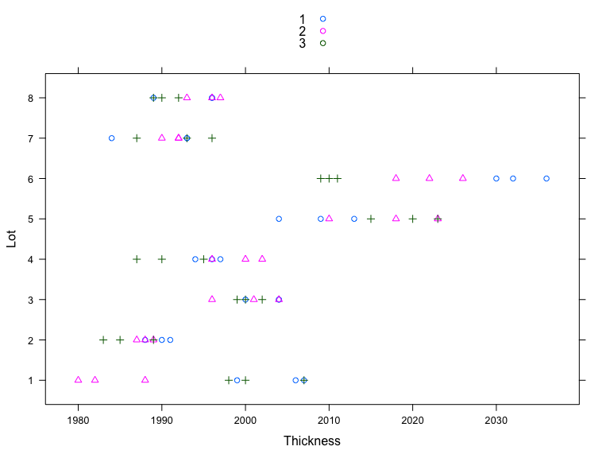
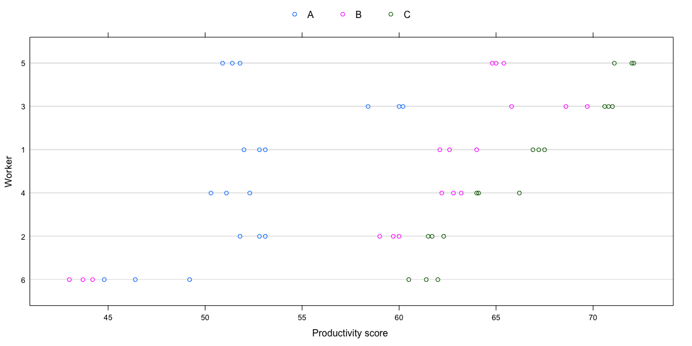
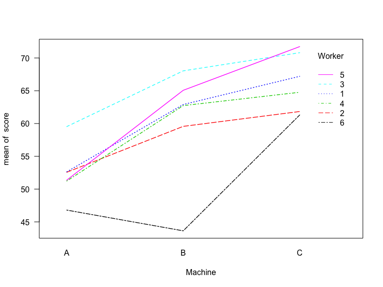
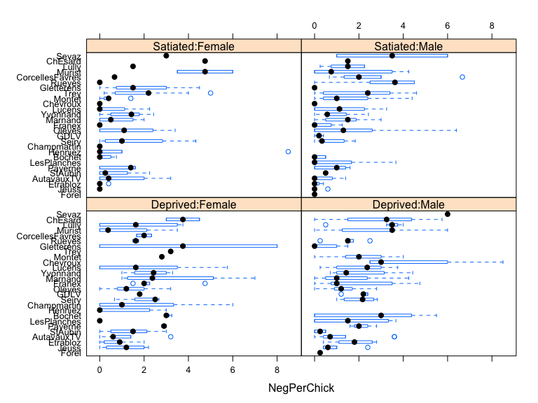
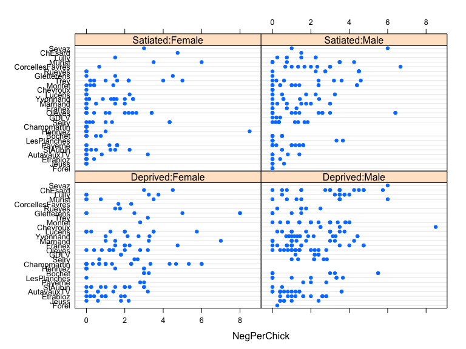

# Case studies
Dae-Jin Lee  
<http://idaejin.github.io/bcam-courses>  


---------------------------------------


# Variability in Semiconductor Manufacturing

These data comes *from a passive data collection study in the semiconductor industry where the objective is to estimate the variance components to determine the assignable causes of the observed variability*. The observed response is the thickness of the oxide layer on silicon wafers, measured at three different sites of each of three wafers selected from each of eight lots sampled from the population of lots.


```r
library(nlme)
library(lattice)
data(Oxide)
?Oxide
xyplot(Lot~Thickness,group=Wafer,auto.key=TRUE,pch=Oxide$Site,data=Oxide)
```

<div class="figure">

<p class="caption">*Thickness of Oxide layer measured on different sites of wafers selected from a sample of manufacturing lots.*</p>
</div>

```r
xtabs(~ Lot + Wafer, Oxide)
```

```
##    Wafer
## Lot 1 2 3
##   1 3 3 3
##   2 3 3 3
##   3 3 3 3
##   4 3 3 3
##   5 3 3 3
##   6 3 3 3
##   7 3 3 3
##   8 3 3 3
```

The Figure suggests that tht *lot-to-lot* variability of the oxide layer thickness is greater than the *wafer-to-wafer* variability within a lot, which, in turn, is greater than the *site-to-site* variation within a wafer.

A multilevel model to describe the oxide thickness $y_{ijk}$ measured on the $k$th site of the $j$th wafer within the $i$th lot is
$$
      y_{ijk}  = \mu + b_i + b_{i,j} + \epsilon_{ijk}, ~ i=1,...,8 \quad j,k = 1,2,3  
$$
with 
$$
      b_i \sim \mathcal{N}(0,\sigma_1^2), \quad b_{i,j} \sim \mathcal{N}(0,\sigma_2^2), \quad \epsilon_{ijk} \sim \mathcal{N}(0,\sigma^2),
$$
where `lot` random effects $b_i$ are assumed to be independent for different $i$, the *wafer within lot* random effects $b_{i,j}$ are assumed to be independent for different $i$ and $j$ and to be independent of the $b_i$, and the *within-group* errors $\epsilon_{ijk}$ are assumed to be independent for different $i,j,$ and $k$ and to be independent of the random effects. 

The most general form of the argument `random` when `lme` is used to fit a multilevel model is a *named list* where the names define the grouping factors and the formulas describe the random-effects models at each level. The order of nesting is taken to be the order of the elements in the list, with the outermost level appearing first. 


```r
random = list(Lot= ~1, Wafer = ~1)
```

When the random-effects formulas are the same for all levels of grouping, we can replace the named list by a one-sided formula with the common random-effects formula and an expression defining the grouping structure separated by a `|` operation 


```r
random = list(~1|Lot/Wafer)
```


```r
formula(Oxide) # grouping formula already defined
```

```
## Thickness ~ 1 | Lot/Wafer
```


```r
fm1Oxide <- lme(Thickness~1,Oxide) 
# or lme(Thickness~1,random=list(Lot= ~1, Wafer = ~1),Oxide)
# or lme(Thickness~1,random= ~1|Lot/Wafer,Oxide)
fm1Oxide
```

```
## Linear mixed-effects model fit by REML
##   Data: Oxide 
##   Log-restricted-likelihood: -227.011
##   Fixed: Thickness ~ 1 
## (Intercept) 
##    2000.153 
## 
## Random effects:
##  Formula: ~1 | Lot
##         (Intercept)
## StdDev:    11.39768
## 
##  Formula: ~1 | Wafer %in% Lot
##         (Intercept) Residual
## StdDev:    5.988802 3.545341
## 
## Number of Observations: 72
## Number of Groups: 
##            Lot Wafer %in% Lot 
##              8             24
```


```r
intervals(fm1Oxide,which="var-cov")
```

```
## Approximate 95% confidence intervals
## 
##  Random Effects:
##   Level: Lot 
##                    lower     est.   upper
## sd((Intercept)) 6.390082 11.39768 20.3295
##   Level: Wafer 
##                    lower     est.    upper
## sd((Intercept)) 4.064776 5.988802 8.823548
## 
##  Within-group standard error:
##    lower     est.    upper 
## 2.902607 3.545341 4.330399
```

All intervals are bounded well away from zero, indicating that the two random effects should be kept. We can test, for example, if the *wafer within lot* random effect can be eliminated from the model with 


```r
fm2Oxide <- update(fm1Oxide, random = ~1|Lot)
anova(fm1Oxide,fm2Oxide)
```

```
##          Model df      AIC      BIC    logLik   Test  L.Ratio p-value
## fm1Oxide     1  4 462.0221 471.0728 -227.0110                        
## fm2Oxide     2  3 497.1317 503.9197 -245.5658 1 vs 2 37.10961  <.0001
```
The very high value of the LR test confirms the significance of that term in the model. 


# Titanic survivors data

The dataset is a collection of data about some of the passengers, and the goal is to predict the survival (either 1 if the passenger survived or 0 if they did not) based on some features such as the class of service, the sex, the age etc. As you can see, we are going to use both categorical and continuous variables.

```
VARIABLE DESCRIPTIONS:
pclass          Passenger Class
                (1 = 1st; 2 = 2nd; 3 = 3rd)
survival        Survival
                (0 = No; 1 = Yes)
name            Name
sex             Sex
age             Age
sibsp           Number of Siblings/Spouses Aboard
parch           Number of Parents/Children Aboard
ticket          Ticket Number
fare            Passenger Fare
cabin           Cabin
embarked        Port of Embarkation
                (C = Cherbourg; Q = Queenstown; S = Southampton)
boat            Lifeboat
body            Body Identification Number
home_dest       Home/Destination
```
Full description of [data set](http://biostat.mc.vanderbilt.edu/wiki/pub/Main/DataSets/titanic3info.txt)


Read `train` and `test` set

```r
train <- read.csv('extra-data/titanic_train.csv',header=TRUE,row.names=1)
 test <- read.csv('extra-data/titanic_test.csv',header=TRUE,row.names=1)
```

## Questions

* Fit a logistic model with `pclass` as exploratory variable. What is the interpretation of the fitted model?
* Find the best possible logistic regression model based on all the available variables.


--------------------------

# Minnesota Health Plan Dataset 

Number of clinic visits and calls to clinic for 4 nonoverlapping six month periods for each of 121 senior citizens enrolled in a medical plan. From:

*Waller LA, Zelterman D (1979). Log-Linear Modeling with the Negative Multinomial Distribution Biometrics 53(3): 971-982*


```r
source("extra-data/mhp.r")

head(mhp)
```

```
##   Count Subject Event Period
## 1     4       1     1      1
## 2     0       1     2      1
## 3     2       1     1      2
## 4     3       1     2      2
## 5     3       1     1      3
## 6     0       1     2      3
```

```r
library(lme4)
```

```
## Loading required package: Matrix
```

```
## 
## Attaching package: 'lme4'
```

```
## The following object is masked from 'package:nlme':
## 
##     lmList
```

```r
mod <- glmer(Count ~ Event*Period + (1|Subject) + (1|Subject:Event) + (1|Subject:Period), data=mhp,
family=poisson())
```

```
## Warning in checkConv(attr(opt, "derivs"), opt$par, ctrl = control
## $checkConv, : Model failed to converge with max|grad| = 0.00781781 (tol =
## 0.001, component 1)
```


# Productivity Scores for Machines and Workers


Data on an experiment to compare three brands of machines used in an industrial process are presented in @Milliken92. Six workers were chosen randomly among the employees of a factory to operate each machine three times. The response is an overall productivity score taking into account the number and quality of components produced.


```r
library(nlme)
data(Machines)
head(Machines)
```

```
## Grouped Data: score ~ Machine | Worker
##   Worker Machine score
## 1      1       A  52.0
## 2      1       A  52.8
## 3      1       A  53.1
## 4      2       A  51.8
## 5      2       A  52.8
## 6      2       A  53.1
```

```r
?Machines
```

The next Figure shows that there are differences between machines and also some differences between workers. There is also very little variability in the productivity score for the same worker using the same machine. 


```r
plot(Machines)
```

<div class="figure">

<p class="caption">*Productivity scores for three types of machines as used by six different workers. Scores take into account the number and the quality of components produced.*</p>
</div>

We can model the `Worker` factor as a random effect and `Machine` as fixed. 

<!-- -->

First, we consider a model 
$$
    y_{ijk} = \mu_j + b_i + \epsilon_{ijk}, \quad i=1,...,6
,\quad j=1,...,3,\quad k=1,...,3,
$$
with $b_i \sim \mathcal{N}(0,\sigma^2_b)$, $\epsilon_{ijk}\sim\mathcal{N}(0,\sigma^2)$.


```r
fm1Machine <- lme(score ~ Machine, data=Machines,random= ~1|Worker)
fm1Machine
```

```
## Linear mixed-effects model fit by REML
##   Data: Machines 
##   Log-restricted-likelihood: -143.4391
##   Fixed: score ~ Machine 
## (Intercept)    MachineB    MachineC 
##   52.355556    7.966667   13.916667 
## 
## Random effects:
##  Formula: ~1 | Worker
##         (Intercept) Residual
## StdDev:    5.146552 3.161647
## 
## Number of Observations: 54
## Number of Groups: 6
```

We can consider a random interaction term, by $b_{ij}$, $i=1,...,6$, $j=1,...,3$, is
$$
    y_{ijk} = \mu_j + b_i + b_{ij} + \epsilon_{ijk}, \quad i=1,...,6
,\quad j=1,...,3,\quad k=1,...,3,
$$
with $b_i \sim \mathcal{N}(0,\sigma_1^2)$, $b_{ij} \sim \mathcal{N}(0,\sigma_2^2)$, $\epsilon_{ijk}\sim\mathcal{N}(0,\sigma^2)$.

This model has random effects at two levels: 

* the effects $b_i$ for the worker and
* the effects $b_{ij}$ for the type of machine within each worker. 


```r
fm2Machine <- update(fm1Machine,random= ~1|Worker/Machine)
fm2Machine
```

```
## Linear mixed-effects model fit by REML
##   Data: Machines 
##   Log-restricted-likelihood: -107.8438
##   Fixed: score ~ Machine 
## (Intercept)    MachineB    MachineC 
##   52.355556    7.966667   13.916667 
## 
## Random effects:
##  Formula: ~1 | Worker
##         (Intercept)
## StdDev:     4.78105
## 
##  Formula: ~1 | Machine %in% Worker
##         (Intercept)  Residual
## StdDev:    3.729532 0.9615771
## 
## Number of Observations: 54
## Number of Groups: 
##              Worker Machine %in% Worker 
##                   6                  18
```

Here the random effect structure is read as `Worker` and `Machine` within `Worker`.


```r
anova(fm1Machine,fm2Machine)
```

```
##            Model df      AIC      BIC    logLik   Test  L.Ratio p-value
## fm1Machine     1  5 296.8782 306.5373 -143.4391                        
## fm2Machine     2  6 227.6876 239.2785 -107.8438 1 vs 2 71.19063  <.0001
```
Reject $H_0:\sigma_2^2 = 0$ 


```r
intervals(fm2Machine)
```

```
## Approximate 95% confidence intervals
## 
##  Fixed effects:
##                 lower      est.    upper
## (Intercept) 47.314062 52.355556 57.39705
## MachineB     3.116071  7.966667 12.81726
## MachineC     9.066071 13.916667 18.76726
## attr(,"label")
## [1] "Fixed effects:"
## 
##  Random Effects:
##   Level: Worker 
##                    lower    est.    upper
## sd((Intercept)) 2.249773 4.78105 10.16033
##   Level: Machine 
##                    lower     est.    upper
## sd((Intercept)) 2.382804 3.729532 5.837413
## 
##  Within-group standard error:
##     lower      est.     upper 
## 0.7627736 0.9615771 1.2121953
```


# Alligator data

Data from a study of the primary food choices of alligators in four Florida lakes. Researchers classified the stomach contents of 219 captured alligators into five categories: Fish (the most common primary food choice), Invertebrate (snails, insects, crayfish, etc.), Reptile (turtles, alligators), Bird, and Other (amphibians, plants, household pets, stones, and other debris).


```r
alligator <- read.table("http://www.hofroe.net/stat557/data/alligator.txt", header=TRUE)

summary(alligator)
```

```
##        ID            food      size     gender        lake   
##  Min.   :  1.0   bird  :13   <2.3:124   f: 89   george  :63  
##  1st Qu.: 55.5   fish  :94   >2.3: 95   m:130   hancock :55  
##  Median :110.0   invert:61                      oklawaha:48  
##  Mean   :110.0   other :32                      trafford:53  
##  3rd Qu.:164.5   rep   :19                                   
##  Max.   :219.0
```

```r
# make the fish the first variable
alligator$food <- factor(alligator$food, levels=levels(alligator$food)[c(2,1,3,4,5)])
```


```r
library(nnet)
alli.main <- multinom(food~lake+size+gender, data=alligator)
```

```
## # weights:  35 (24 variable)
## initial  value 352.466903 
## iter  10 value 271.274792
## iter  20 value 268.935538
## final  value 268.932740 
## converged
```

```r
alli.main
```

```
## Call:
## multinom(formula = food ~ lake + size + gender, data = alligator)
## 
## Coefficients:
##        (Intercept) lakehancock lakeoklawaha laketrafford   size>2.3
## bird    -2.4321397   0.5754699  -0.55020075     1.237216  0.7300740
## invert   0.1690702  -1.7805555   0.91304120     1.155722 -1.3361658
## other   -1.4309095   0.7667093   0.02603021     1.557820 -0.2905697
## rep     -3.4161432   1.1296426   2.53024945     3.061087  0.5571846
##           genderm
## bird   -0.6064035
## invert -0.4629388
## other  -0.2524299
## rep    -0.6276217
## 
## Residual Deviance: 537.8655 
## AIC: 585.8655
```

```r
summary(alli.main)
```

```
## Call:
## multinom(formula = food ~ lake + size + gender, data = alligator)
## 
## Coefficients:
##        (Intercept) lakehancock lakeoklawaha laketrafford   size>2.3
## bird    -2.4321397   0.5754699  -0.55020075     1.237216  0.7300740
## invert   0.1690702  -1.7805555   0.91304120     1.155722 -1.3361658
## other   -1.4309095   0.7667093   0.02603021     1.557820 -0.2905697
## rep     -3.4161432   1.1296426   2.53024945     3.061087  0.5571846
##           genderm
## bird   -0.6064035
## invert -0.4629388
## other  -0.2524299
## rep    -0.6276217
## 
## Std. Errors:
##        (Intercept) lakehancock lakeoklawaha laketrafford  size>2.3
## bird     0.7706720   0.7952303    1.2098680    0.8661052 0.6522657
## invert   0.3787475   0.6232075    0.4761068    0.4927795 0.4111827
## other    0.5381162   0.5685673    0.7777958    0.6256868 0.4599317
## rep      1.0851582   1.1928075    1.1221413    1.1297557 0.6466092
##          genderm
## bird   0.6888385
## invert 0.3955162
## other  0.4663546
## rep    0.6852750
## 
## Residual Deviance: 537.8655 
## AIC: 585.8655
```

```r
alli.full <- multinom(food~size*gender*lake, data=alligator)
```

```
## # weights:  85 (64 variable)
## initial  value 352.466903 
## iter  10 value 261.012428
## iter  20 value 247.469586
## iter  30 value 244.113978
## iter  40 value 243.838562
## iter  50 value 243.803340
## iter  60 value 243.800917
## final  value 243.800898 
## converged
```

```r
alli.twoway <- multinom(food~size*gender*lake-size:gender:lake, data=alligator)
```

```
## # weights:  70 (52 variable)
## initial  value 352.466903 
## iter  10 value 267.882553
## iter  20 value 250.318535
## iter  30 value 245.278125
## iter  40 value 244.790627
## iter  50 value 244.771907
## iter  60 value 244.771291
## final  value 244.771287 
## converged
```

```r
alli.null <- multinom(food~1, data=alligator)
```

```
## # weights:  10 (4 variable)
## initial  value 352.466903 
## final  value 302.181462 
## converged
```

```r
deviance(alli.full)
```

```
## [1] 487.6018
```

```r
deviance(alli.twoway)
```

```
## [1] 489.5426
```

```r
deviance(alli.main)
```

```
## [1] 537.8655
```

```r
deviance(alli.null)
```

```
## [1] 604.3629
```

```r
# test each individual main effect
alli.g <- multinom(food~gender, data=alligator)
```

```
## # weights:  15 (8 variable)
## initial  value 352.466903 
## iter  10 value 301.192714
## final  value 301.129428 
## converged
```

```r
alli.s <- multinom(food~size, data=alligator)
```

```
## # weights:  15 (8 variable)
## initial  value 352.466903 
## iter  10 value 294.689203
## final  value 294.606678 
## converged
```

```r
alli.l <- multinom(food~lake, data=alligator)
```

```
## # weights:  25 (16 variable)
## initial  value 352.466903 
## iter  10 value 281.030560
## iter  20 value 280.583926
## final  value 280.583844 
## converged
```

```r
# gender does not seem to be significant
anova(alli.null,alli.g)
```

```
## Likelihood ratio tests of Multinomial Models
## 
## Response: food
##    Model Resid. df Resid. Dev   Test    Df LR stat.   Pr(Chi)
## 1      1       872   604.3629                                
## 2 gender       868   602.2589 1 vs 2     4 2.104069 0.7166248
```

```r
# size and lake are significant
anova(alli.null,alli.s)
```

```
## Likelihood ratio tests of Multinomial Models
## 
## Response: food
##   Model Resid. df Resid. Dev   Test    Df LR stat.     Pr(Chi)
## 1     1       872   604.3629                                  
## 2  size       868   589.2134 1 vs 2     4 15.14957 0.004400846
```

```r
anova(alli.null,alli.l)
```

```
## Likelihood ratio tests of Multinomial Models
## 
## Response: food
##   Model Resid. df Resid. Dev   Test    Df LR stat.      Pr(Chi)
## 1     1       872   604.3629                                   
## 2  lake       860   561.1677 1 vs 2    12 43.19524 2.092388e-05
```

```r
# interaction between size and lake does not seem necessary
alli.sl <- multinom(food~size*lake, data=alligator)
```

```
## # weights:  45 (32 variable)
## initial  value 352.466903 
## iter  10 value 264.954037
## iter  20 value 261.952567
## iter  30 value 261.511072
## iter  40 value 261.500360
## final  value 261.500226 
## converged
```

```r
alli.s.l <- multinom(food~size+lake, data=alligator)
```

```
## # weights:  30 (20 variable)
## initial  value 352.466903 
## iter  10 value 270.844027
## iter  20 value 270.041364
## final  value 270.040140 
## converged
```

```r
anova(alli.s.l, alli.sl)
```

```
## Likelihood ratio tests of Multinomial Models
## 
## Response: food
##         Model Resid. df Resid. Dev   Test    Df LR stat.   Pr(Chi)
## 1 size + lake       856   540.0803                                
## 2 size * lake       844   523.0005 1 vs 2    12 17.07983 0.1466191
```

```r
anova(alli.null,alli.s.l)
```

```
## Likelihood ratio tests of Multinomial Models
## 
## Response: food
##         Model Resid. df Resid. Dev   Test    Df LR stat.      Pr(Chi)
## 1           1       872   604.3629                                   
## 2 size + lake       856   540.0803 1 vs 2    16 64.28265 9.784183e-08
```

```r
anova(alli.null,alli.s.l)
```

```
## Likelihood ratio tests of Multinomial Models
## 
## Response: food
##         Model Resid. df Resid. Dev   Test    Df LR stat.      Pr(Chi)
## 1           1       872   604.3629                                   
## 2 size + lake       856   540.0803 1 vs 2    16 64.28265 9.784183e-08
```

Zuur et al. (2007) used marine benthic data from nine inter-tidal areas along the Dutch coast. The data were collected by the Dutch institute RIKZ in the summer of 2002. In each inter-tidal area (denoted by ‘beach’), five samples were taken, and the macro-fauna and abiotic variables were measured. Zuur et al. (2007) used species richness (the number of different species) and NAP (the height of a sampling station compared to mean tidal level) from these data to illustrate statistical methods like linear regression and mixed effects modelling. 


# Owls data

Analysis of owl nestling begging data from Zuur et al 2009/Roulin and Bersier 2007.


```r
Owls <- read.table("extra-data/Owls.txt",header=TRUE)


library(lattice)
print(bwplot(reorder(Nest,NegPerChick)~NegPerChick|FoodTreatment:SexParent,
       data=Owls))
```

<!-- -->

```r
print(dotplot(reorder(Nest,NegPerChick)~NegPerChick|FoodTreatment:SexParent,
       data=Owls))
```

<!-- -->


```r
g1 <- glmer(SiblingNegotiation~FoodTreatment*SexParent+offset(log(BroodSize))+
            (1|Nest),family=poisson,data=Owls)
print(summary(g1))
```

```
## Generalized linear mixed model fit by maximum likelihood (Laplace
##   Approximation) [glmerMod]
##  Family: poisson  ( log )
## Formula: 
## SiblingNegotiation ~ FoodTreatment * SexParent + offset(log(BroodSize)) +  
##     (1 | Nest)
##    Data: Owls
## 
##      AIC      BIC   logLik deviance df.resid 
##   5212.8   5234.8  -2601.4   5202.8      594 
## 
## Scaled residuals: 
##     Min      1Q  Median      3Q     Max 
## -3.5529 -1.7971 -0.6842  1.2689 11.4312 
## 
## Random effects:
##  Groups Name        Variance Std.Dev.
##  Nest   (Intercept) 0.2063   0.4542  
## Number of obs: 599, groups:  Nest, 27
## 
## Fixed effects:
##                                     Estimate Std. Error z value Pr(>|z|)
## (Intercept)                          0.65585    0.09567   6.855 7.12e-12
## FoodTreatmentSatiated               -0.65612    0.05606 -11.705  < 2e-16
## SexParentMale                       -0.03705    0.04501  -0.823   0.4104
## FoodTreatmentSatiated:SexParentMale  0.13135    0.07036   1.867   0.0619
##                                        
## (Intercept)                         ***
## FoodTreatmentSatiated               ***
## SexParentMale                          
## FoodTreatmentSatiated:SexParentMale .  
## ---
## Signif. codes:  0 '***' 0.001 '**' 0.01 '*' 0.05 '.' 0.1 ' ' 1
## 
## Correlation of Fixed Effects:
##             (Intr) FdTrtS SxPrnM
## FdTrtmntStt -0.225              
## SexParentMl -0.292  0.491       
## FdTrtmS:SPM  0.170 -0.768 -0.605
```


