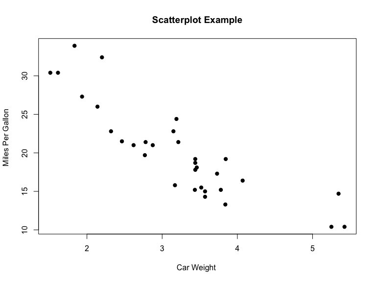
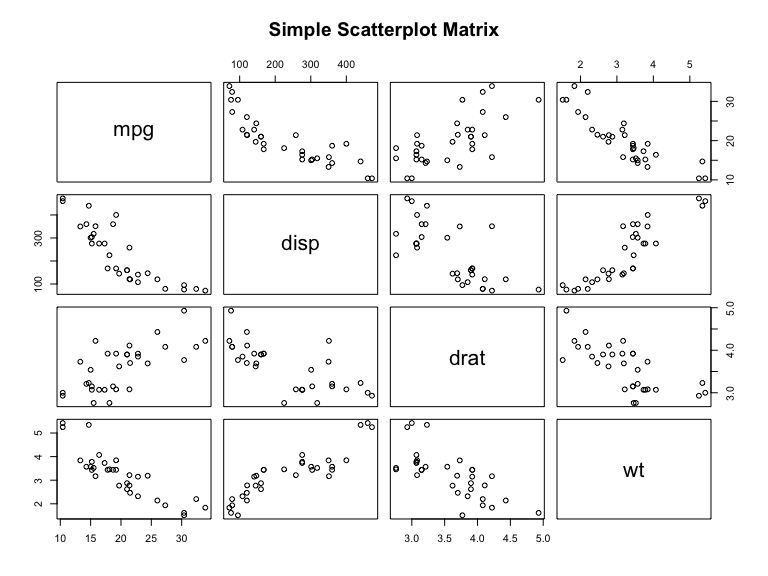
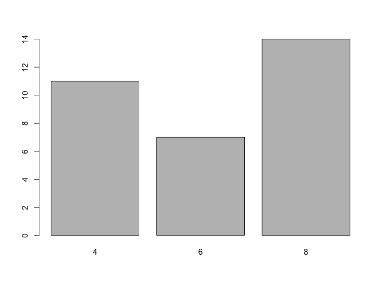
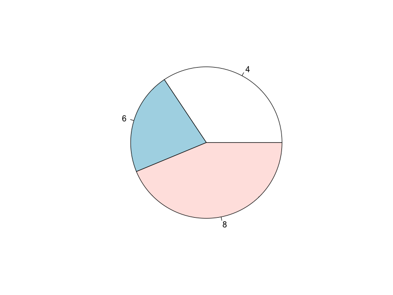
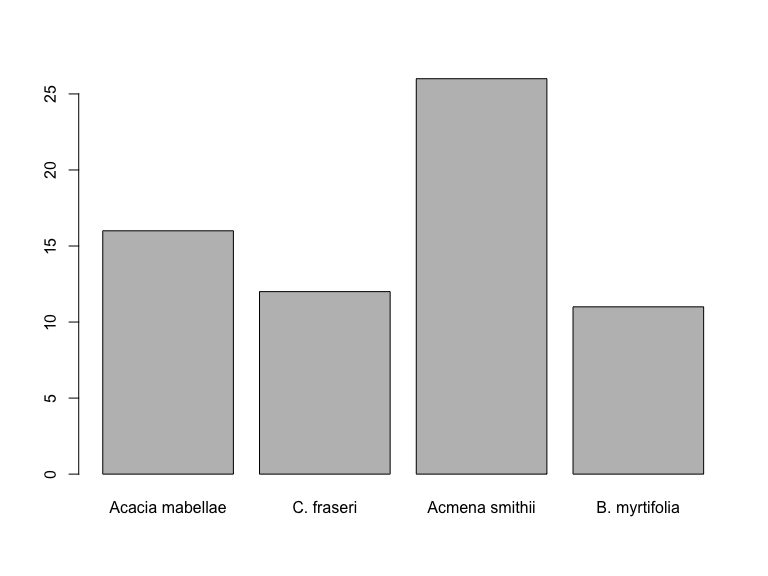
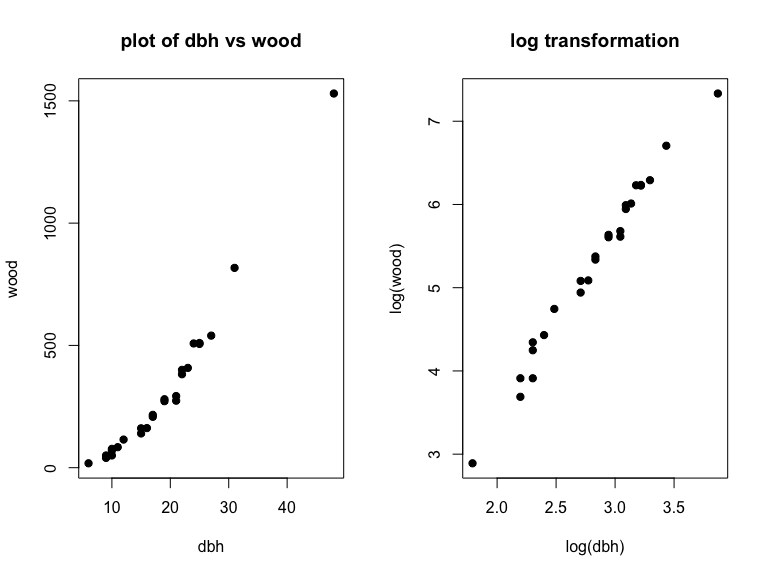
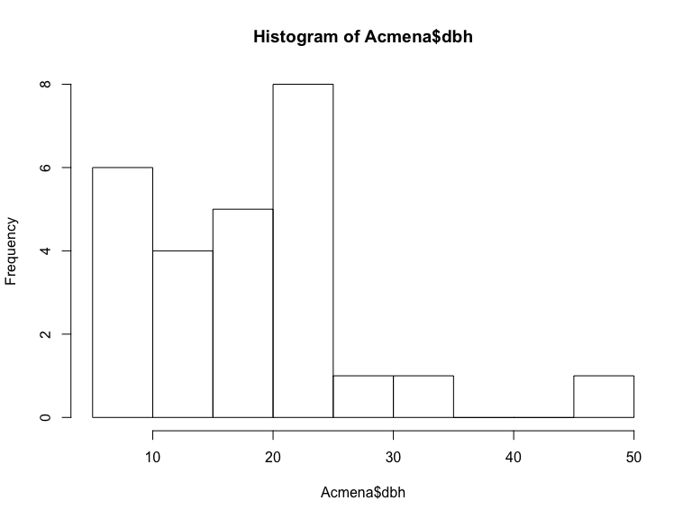

# **R** basics for beginners
Dae-Jin Lee  
<http://idaejin.github.io/bcam-courses>  


---------------------------------------

# Why R ? 

* **R** is a command-driven statistical package.

* The most important reasons to use **R** are:

    + **R** is free and multiplatform (Windows/Linux/MACos)

    + **R** allows you to do all the statistical tests/models/analysis you need :)

    + Excellent graphics and programming capabilities

    + Growing community of users and developers 

    + Lots of online resources

    + An user-friendly interface is RStudio <http://www.rstudio.com/>

-------------------------------

# Statistical features

* Graphical Techniques (Exploratory Data Analysis)
* Linear and non-linear modeling (linear regression, non-parametric regression, smoothing, etc ...)
* Classical statistical tests
* Time-series analysis
* Econometrics
* Classification and clustering (data mining, machine learning)
* Optimization and Mathematical Programming
* Bayesian inference etc ....

**Visit** http://cran.r-project.org/web/views
 or http://stackoverflow.com/questions/tagged/r
 
 
------------------------------
 
# Start with **R**

* Get current working directory 

```r
getwd() 
```

* Set working directory

```r
setwd("/Users/dlee") 
```

## Install and load an **R** library
 

```r
install.packages("DAAG") # (Data Analysis And Graphics)
```

* Once installed the package, load it

```r
library(DAAG) # or require(DAAG)
```
 

-------------------------------------


# Data Import

* Several formats are available (`.txt`, `.csv`, `.xls`, `.xlsx`, `SAS`, `Stata`, etc...)
* Some **R** libraries to import data are 

```r
library(gdata)
library(foreign)
```

\bigskip

* Read data from a `.txt` or `.csv` files (*e.g.:* created in `Rintro1.R`)

```r
mydata1 = read.table("cardata.txt") 
mydata2 = read.csv("cardata.csv")  
```

* Other formats `.xls` and `.xlsx`
\medskip


```r
# read in the worksheet named mysheet
mydata <- read.xlsx("myexcel.xlsx", sheetName = "mysheet")
```

---------------------------------


* Minitab, SPSS, SAS or Stata \medskip


```r
library(foreign)                   
mydata = read.mtp("mydata.mtp")  # Minitab
mydata = read.spss("myfile", to.data.frame=TRUE) # SPSS
mydata = read.dta("mydata.dta") # Stata
```

* Or

```r
library(Hmisc)
mydata = spss.get("mydata.por", use.value.labels=TRUE)  # SPSS
```

-------------------------

# Exporting data

* There are numerous methods for exporting **R** objects into other formats . For SPSS, SAS and Stata. you will need to load the `foreign` packages. For Excel, you will need the `xlsx` package.  
 
 - Tab delimited text file


```r
write.table(mydata, "mydata.txt", sep="\t") 
```

*  Excel spreadsheet


```r
library(xlsx)
write.xlsx(mydata, "mydata.xlsx")
```


----------------------------

# Data vectors

* Download `R code` [here](http://idaejin.github.io/bcam-courses/rbasics/rbasics.R)

* Create a vector of weights and heights


```r
weight<-c(60,72,57,90,95,72) # function c is used to concatenate data/numbers or vectors 
class(weight)
```

```
## [1] "numeric"
```

```r
height<-c(1.75,1.80,1.65,1.90,1.74,1.91)
```

* calculate Body Mass Index

```r
bmi<- weight/height^2
bmi
```

```
## [1] 19.59184 22.22222 20.93664 24.93075 31.37799 19.73630
```

----------------------------


# Basic statistics 

* mean, median, st dev, variance


```r
mean(weight) 
median(weight)
sd(weight)
var(weight)
```

* summarize data


```r
summary(weight)
```

```
##    Min. 1st Qu.  Median    Mean 3rd Qu.    Max. 
##   57.00   63.00   72.00   74.33   85.50   95.00
```

* or

```r
min(weight)
max(weight)
range(weight)
quantile(weight)
sum(weight)
length(weight)
```


----------------------------------

# Character vectors and factor variables


```r
subject <- c("John","Peter","Chris","Tony","Mary","Jane")
sex <- c("MALE","MALE","MALE","MALE","FEMALE","FEMALE")
class(subject)
```

```
## [1] "character"
```

```r
table(sex)
```

```
## sex
## FEMALE   MALE 
##      2      4
```


-----------------------------------


# Data frames

```r
Dat <- data.frame(subject,sex,weight,height)
# add bmi to Dat
Dat$bmi <- bmi  # or Dat$bmi <- weight/height^2
class(Dat)
```

```
## [1] "data.frame"
```

```r
str(Dat) # display object structure
```

```
## 'data.frame':	6 obs. of  5 variables:
##  $ subject: Factor w/ 6 levels "Chris","Jane",..: 3 5 1 6 4 2
##  $ sex    : Factor w/ 2 levels "FEMALE","MALE": 2 2 2 2 1 1
##  $ weight : num  60 72 57 90 95 72
##  $ height : num  1.75 1.8 1.65 1.9 1.74 1.91
##  $ bmi    : num  19.6 22.2 20.9 24.9 31.4 ...
```


```r
# Change rownames
rownames(Dat)<-c("A","B","C","D","E","F")

# Access to data frame elements (similar to a matrix)
Dat[,1]     # 1st column
```

```
## [1] John  Peter Chris Tony  Mary  Jane 
## Levels: Chris Jane John Mary Peter Tony
```

```r
Dat[,1:3]   # 1st to 3rd columns
```

```
##   subject    sex weight
## A    John   MALE     60
## B   Peter   MALE     72
## C   Chris   MALE     57
## D    Tony   MALE     90
## E    Mary FEMALE     95
## F    Jane FEMALE     72
```

```r
Dat[1:2,]   # 1st to 2nd row
```

```
##   subject  sex weight height      bmi
## A    John MALE     60   1.75 19.59184
## B   Peter MALE     72   1.80 22.22222
```


# Working with data frames
## Example: Analyze data by groups

*  Obtain the mean weight, heigth and bmi means by FEMALES and MALES:

1. Select each group and compute the mean


```r
Dat[sex=="MALE",]
Dat[sex=="FEMALE",]

mean(Dat[sex=="MALE",3])  # weight average of MALEs
mean(Dat[sex=="MALE","weight"])
```

2. Use `apply` by columns 

```r
apply(Dat[sex=="FEMALE",3:5],2,mean)
apply(Dat[sex=="MALE",3:5],2,mean)

# we can use apply with our own function
apply(Dat[sex=="FEMALE",3:5],2,function(x){x+2})
```

3. `by` and `colMeans`

```r
by(Dat[,3:5],sex, colMeans) # 'by' splits your data by factors and do calculations on each subset.
```

4. `aggregate`


```r
# another option
aggregate(Dat[,3:5], by=list(sex),mean) 
```

------------------------------------

# Logical vectors

* Choose individuals with BMI>22

```r
bmi
bmi>22
as.numeric(bmi>22) # convert a logical condition to a numeric value 0/1
which(bmi>22)  # gives the position of bmi for which bmi>22
```

* Which are between 20 and 25?


```r
bmi > 20 & bmi < 25
which(bmi > 20 & bmi < 25)
```

--------------------------------------

# Working with vectors 

* Concatenate


```r
x <- c(2, 3, 5, 2, 7, 1)
y <- c(10, 15, 12)
z <- c(x,y)  # concatenates x and y
```

* list two vectors


```r
zz <- list(x,y) # create a list
unlist(zz) # unlist the list converting it to a concatenated vector
```

```
## [1]  2  3  5  2  7  1 10 15 12
```

* subset of vectors


```r
x[c(1,3,4)]
```

```
## [1] 2 5 2
```

```r
x[-c(2,6)] # negative subscripts omit the chosen elements 
```

```
## [1] 2 5 2 7
```

* Sequences

```r
seq(1,9) # or 1:9
```

```
## [1] 1 2 3 4 5 6 7 8 9
```

```r
seq(1,9,by=1)
```

```
## [1] 1 2 3 4 5 6 7 8 9
```

```r
seq(1,9,by=0.5)
```

```
##  [1] 1.0 1.5 2.0 2.5 3.0 3.5 4.0 4.5 5.0 5.5 6.0 6.5 7.0 7.5 8.0 8.5 9.0
```

```r
seq(1,9,length=20)
```

```
##  [1] 1.000000 1.421053 1.842105 2.263158 2.684211 3.105263 3.526316
##  [8] 3.947368 4.368421 4.789474 5.210526 5.631579 6.052632 6.473684
## [15] 6.894737 7.315789 7.736842 8.157895 8.578947 9.000000
```

* Replicates


```r
oops <- c(7,9,13)
rep(oops,3) # repeats the entire vector "oops" three times
rep(oops,1:3) # this function has the number 3 replaced 
              #  by a vector with the three values (1,2,3) 
              #  indicating that 7 should be repeated once, 9 twice and 13 three times.

rep(c(2,3,5), 4)
rep(1:2,c(10,15))

rep(c("MALE","FEMALE"),c(4,2)) # it also works with character vectors 
c(rep("MALE",3), rep("FEMALE",2))
```

---------------------------------------------


# Matrices and arrays


```r
x<- 1:12
x
```

```
##  [1]  1  2  3  4  5  6  7  8  9 10 11 12
```

```r
dim(x)<-c(3,4)  # 3 rows and 4 columns

X <- matrix(1:12,nrow=3,byrow=TRUE)
X <- matrix(1:12,nrow=3,byrow=FALSE)

# rownames, colnames

rownames(X) <- c("A","B","C")
colnames(X) <- LETTERS[4:7]
colnames(X) <- month.abb[4:7]
```

* Column/Row bind operations `cbind()`, `rbind()`


```r
Y <- matrix(0.1*(1:12),3,4)

cbind(X,Y)  # bind column-wise
```

```
##   Apr May Jun Jul                
## A   1   4   7  10 0.1 0.4 0.7 1.0
## B   2   5   8  11 0.2 0.5 0.8 1.1
## C   3   6   9  12 0.3 0.6 0.9 1.2
```

```r
rbind(X,Y)  # bind row-wise
```

```
##   Apr May Jun  Jul
## A 1.0 4.0 7.0 10.0
## B 2.0 5.0 8.0 11.0
## C 3.0 6.0 9.0 12.0
##   0.1 0.4 0.7  1.0
##   0.2 0.5 0.8  1.1
##   0.3 0.6 0.9  1.2
```

-----------------------------------------------

# Factors


```r
gender<-c(rep("female",691),rep("male",692))
class(gender)
```

```
## [1] "character"
```

```r
# change vector to factor (i.e. a category)
gender<- factor(gender)
levels(gender)
```

```
## [1] "female" "male"
```

```r
summary(gender)
```

```
## female   male 
##    691    692
```

```r
table(gender)
```

```
## gender
## female   male 
##    691    692
```

```r
status<- c(0,3,2,1,4,5)    # This command creates a numerical vector ???pain???, encoding the pain level of five patients.
fstatus <- factor(status, levels=0:5)
levels(fstatus) <- c("student","engineer","unemployed","lawyer","economist","dentist")

Dat$status <- fstatus
Dat
```

```
##   subject    sex weight height      bmi     status
## A    John   MALE     60   1.75 19.59184    student
## B   Peter   MALE     72   1.80 22.22222     lawyer
## C   Chris   MALE     57   1.65 20.93664 unemployed
## D    Tony   MALE     90   1.90 24.93075   engineer
## E    Mary FEMALE     95   1.74 31.37799  economist
## F    Jane FEMALE     72   1.91 19.73630    dentist
```


-----------------------------------------------

#  Indexing vector with logicals


```r
a <- c(1,2,3,4,5)
b <- c(TRUE,FALSE,FALSE,TRUE,FALSE)

max(a[b])
```

```
## [1] 4
```

```r
sum(a[b])
```

```
## [1] 5
```

# Missing values (NA)


```r
a <- c(1,2,3,4,NA)
sum(a)
```

```
## [1] NA
```

```r
sum(a,na.rm=TRUE)
```

```
## [1] 10
```

```r
a <- c(1,2,3,4,NA)
is.na(a)
```

```
## [1] FALSE FALSE FALSE FALSE  TRUE
```


------------------------------------------------

# Working with data frames

 * A data frame is used for storing data tables. It is a list of vectors of equal length. 

```r
mtcars
?mtcars       # or help(mtcars)
```

* look at the first rows


```r
head(mtcars)
```

```
##                    mpg cyl disp  hp drat    wt  qsec vs am gear carb
## Mazda RX4         21.0   6  160 110 3.90 2.620 16.46  0  1    4    4
## Mazda RX4 Wag     21.0   6  160 110 3.90 2.875 17.02  0  1    4    4
## Datsun 710        22.8   4  108  93 3.85 2.320 18.61  1  1    4    1
## Hornet 4 Drive    21.4   6  258 110 3.08 3.215 19.44  1  0    3    1
## Hornet Sportabout 18.7   8  360 175 3.15 3.440 17.02  0  0    3    2
## Valiant           18.1   6  225 105 2.76 3.460 20.22  1  0    3    1
```

* Structure of the data frame


```r
str(mtcars) # display the structure of the data frame
```

```
## 'data.frame':	32 obs. of  11 variables:
##  $ mpg : num  21 21 22.8 21.4 18.7 18.1 14.3 24.4 22.8 19.2 ...
##  $ cyl : num  6 6 4 6 8 6 8 4 4 6 ...
##  $ disp: num  160 160 108 258 360 ...
##  $ hp  : num  110 110 93 110 175 105 245 62 95 123 ...
##  $ drat: num  3.9 3.9 3.85 3.08 3.15 2.76 3.21 3.69 3.92 3.92 ...
##  $ wt  : num  2.62 2.88 2.32 3.21 3.44 ...
##  $ qsec: num  16.5 17 18.6 19.4 17 ...
##  $ vs  : num  0 0 1 1 0 1 0 1 1 1 ...
##  $ am  : num  1 1 1 0 0 0 0 0 0 0 ...
##  $ gear: num  4 4 4 3 3 3 3 4 4 4 ...
##  $ carb: num  4 4 1 1 2 1 4 2 2 4 ...
```

* Select a car model:

```r
mtcars["Mazda RX4",] # using rows and columns names
```

```
##           mpg cyl disp  hp drat   wt  qsec vs am gear carb
## Mazda RX4  21   6  160 110  3.9 2.62 16.46  0  1    4    4
```

```r
mtcars[c("Datsun 710", "Camaro Z28"),] 
```

```
##             mpg cyl disp  hp drat   wt  qsec vs am gear carb
## Datsun 710 22.8   4  108  93 3.85 2.32 18.61  1  1    4    1
## Camaro Z28 13.3   8  350 245 3.73 3.84 15.41  0  0    3    4
```

* Or specific variables


```r
mtcars[,c("mpg","am")]
```

```
##                      mpg am
## Mazda RX4           21.0  1
## Mazda RX4 Wag       21.0  1
## Datsun 710          22.8  1
## Hornet 4 Drive      21.4  0
## Hornet Sportabout   18.7  0
## Valiant             18.1  0
## Duster 360          14.3  0
## Merc 240D           24.4  0
## Merc 230            22.8  0
## Merc 280            19.2  0
## Merc 280C           17.8  0
## Merc 450SE          16.4  0
## Merc 450SL          17.3  0
## Merc 450SLC         15.2  0
## Cadillac Fleetwood  10.4  0
## Lincoln Continental 10.4  0
## Chrysler Imperial   14.7  0
## Fiat 128            32.4  1
## Honda Civic         30.4  1
## Toyota Corolla      33.9  1
## Toyota Corona       21.5  0
## Dodge Challenger    15.5  0
## AMC Javelin         15.2  0
## Camaro Z28          13.3  0
## Pontiac Firebird    19.2  0
## Fiat X1-9           27.3  1
## Porsche 914-2       26.0  1
## Lotus Europa        30.4  1
## Ford Pantera L      15.8  1
## Ferrari Dino        19.7  1
## Maserati Bora       15.0  1
## Volvo 142E          21.4  1
```

------------------------------------

# Plotting 

*  Scatterplot


```r
attach(mtcars)
plot(wt, mpg, main="Scatterplot Example",
   xlab="Car Weight ", ylab="Miles Per Gallon ", pch=19) 
```

<!-- -->

* Basic Scatterplot Matrix

```r
pairs(~mpg+disp+drat+wt,data=mtcars,
   main="Simple Scatterplot Matrix")
```

<!-- -->

* Barplot


```r
tab <- table(mtcars[,c("cyl")])
barplot(tab)
```

<!-- -->

* Piechart


```r
pie(tab)
```

<!-- -->


-----------------------------------------

# Exercises

1. The data.frame `VADeaths` contains the death rates per 1000 in Virginia (US) in 1940

    + The death rates are measured per 1000 population per year. They are cross-classified by age group (rows) and population group (columns). The age groups are: 50–54, 55–59, 60–64, 65–69, 70–74 and the population groups are Rural/Male, Rural/Female, Urban/Male and Urban/Female.


```r
VADeaths
```

```
##       Rural Male Rural Female Urban Male Urban Female
## 50-54       11.7          8.7       15.4          8.4
## 55-59       18.1         11.7       24.3         13.6
## 60-64       26.9         20.3       37.0         19.3
## 65-69       41.0         30.9       54.6         35.1
## 70-74       66.0         54.3       71.1         50.0
```

* Compute the mean for each age group. 
      + **Result:**


```
##  50-54  55-59  60-64  65-69  70-74 
## 11.050 16.925 25.875 40.400 60.350
```

* Compute the mean for each population group. 
      + **Result:** 
      

```
##   Rural Male Rural Female   Urban Male Urban Female 
##        32.74        25.18        40.48        25.28
```

2. The  `data.frame` `rainforest` contains several variables from different `species`


```r
library(DAAG)
rainforest
```

  * Create a table of counts for each `species` and make a graphic with the results. 
  
      + **Result:**
      

```
## 
## Acacia mabellae      C. fraseri  Acmena smithii   B. myrtifolia 
##              16              12              26              11
```

<!-- -->

3. The `Acmena` `data.frame` is created from  `rainforest` using the function `subset`. 

  * Plot the relationship between the wood biomass (`wood`) and the diameter of the breast height (`dbh`). Use also a logarithm scale.


```r
Acmena <- subset(rainforest, species == "Acmena smithii")
```

 

<!-- -->


  * Compute a histogram of variable `dbh` using function `hist`

<!-- -->

4. Create a vector of the positive odd integers less than 100 and remove the values greater than 60 and less than 80.

    * **Result:** 
    

```
##  [1] 61 63 65 67 69 71 73 75 77 79
```


* [Solutions here](http://idaejin.github.io/bcam-courses/rbasics/rbasics_sol.R)


